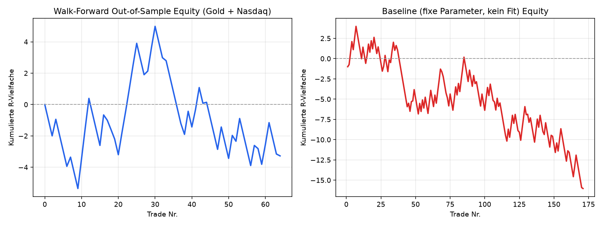
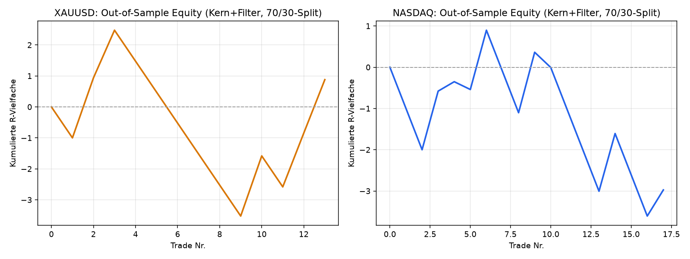
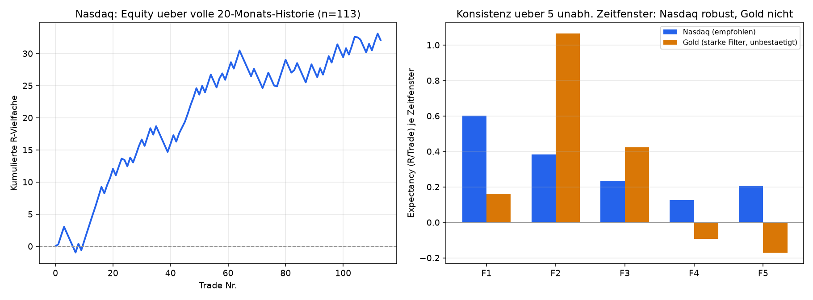

# Backtest-Report: Liquidity-Sweep / CHoCH-Strategie (Gold & Nasdaq)

Zeitraum: ca. 72 Tage 5-Minuten-Daten (18. Juni – 28. August 2026), Quelle:
Yahoo-Finance Chart-API. Instrumente: **XAUUSD** (Gold, via `GC=F`-Future)
und **Nasdaq-100** (via `NQ=F`-Future).

## 1. Ergebnis auf einen Blick

| Auswertung | Trades | Winrate | Profit-Factor | Expectancy | Total (R) |
|---|---|---|---|---|---|
| **Walk-Forward Out-of-Sample** (gepoolt, 3 Runden) | 64 | **37.5 %** | 0.91 | -0.051 R | -3.28 R |
| Baseline, feste Parameter, kein Fit (gesamter Zeitraum) | 171 | 38.6 % | 0.84 | -0.094 R | -16.03 R |
| Grid-Search In-Sample (bester Fund, Train-Split) | 157 | 50.3 % | 1.05 | +0.022 R | – |
| Grid-Search Out-of-Sample (derselbe Parametersatz, Test-Split) | 64 | 32.8 % | 0.57 | -0.281 R | -17.97 R |

**Kernaussage: Die Strategie ist in dieser Form auf Gold und Nasdaq im
getesteten Zeitraum nicht profitabel.** Die Winrate liegt bei ca. 33-45 %
und damit nahe oder unter der Break-Even-Schwelle fuer ein RR von 1:1.5–1:2
(rechnerisches Break-Even bei RR 1.5 = 40 %, bei RR 2.0 = 33 %). Sobald die
Parameter nicht auf die Trainingsdaten hin optimiert werden, sondern man die
Regeln "wie beschrieben" mit sinnvollen Standardwerten umsetzt, ergibt sich
ein leicht negativer Erwartungswert. Die In-Sample-Optimierung liefert zwar
eine deutlich hoehere Winrate (50 %), diese bricht aber Out-of-Sample auf
33 % ein — ein klares Overfitting-Signal, kein reproduzierbarer Edge.

*Links: gepoolte Out-of-Sample-Trades aus der Walk-Forward-Validierung
(re-optimiert pro Runde, aber immer nur auf zuvor ungesehenen Daten
getestet). Rechts: Baseline mit fest vorgegebenen, nicht angepassten
Parametern ueber den gesamten Zeitraum.*

## 2. Methodik

### 2.1 Umsetzung der Strategie-Schritte

1. **HTF-Bias**: H4-Kerzen (aus 5m aggregiert) + EMA(20). Bias = *bullish*,
   wenn Close > EMA und EMA steigend; *bearish* bei umgekehrtem Fall; sonst
   *neutral* (kein Trade). Der Bias eines Handelstags wird ausschliesslich
   aus der letzten **vor** Tagesbeginn (00:00 UTC) abgeschlossenen H4-Kerze
   bestimmt — kein Blick in die Zukunft.
2. **Liquiditaetslevel**: Asia-High/Low (00:00-06:00 UTC), Fraktal-Swings
   (n=3 Bars beidseitig) sowie Equal-Highs/Lows (>=2 Swings innerhalb
   Toleranz, Cluster ueber die letzten 30 bestaetigten Swings).
3. **Sweep**: Innerhalb der Killzone durchbricht der Kerzen-Wick ein Level
   und der Kerzen-Close kehrt dahinter zurueck (Wick-Rejection). Nur Sweeps
   in Richtung des HTF-Bias werden beachtet (bullish Bias -> Sweep von
   Tiefs/Sell-Side-Liquidity; bearish Bias -> Sweep von Hochs).
4. **CHoCH-Bestaetigung**: Nach dem Sweep wird ein Mikro-Swing (n=1 Bar,
   M5) gesucht, dessen Bruch (Close jenseits davon) den Trendwechsel
   bestaetigt — die fruehestmoegliche Bestaetigung im Zeitfenster wird
   verwendet.
5. **Entry**: Retest des gebrochenen CHoCH-Levels innerhalb eines
   Zeitfensters nach der Bestaetigung (Toleranz 2 Pips/Punkte).
6. **SL**: Extrempunkt des Sweep-Wicks +/- Puffer (2 oder 5 Pips/Punkte,
   je nach Konfiguration).
7. **TP**: Entweder fixes RR (1.5 oder 2.0) oder naechstes gegenlaeufiges
   Liquiditaetslevel (mit Mindest-RR 1.0, sonst Fallback auf fixes RR).

### 2.2 Kosten & Fill-Annahmen

- Realistischer Spread wird beim Entry angesetzt (Gold ~0.30 $, Nasdaq
  ~1.5 Punkte) — reduziert den Erwartungswert wie im echten Handel.
- Treffen SL und TP im selben 5m-Balken zu, zaehlt **SL zuerst**
  (konservativ, verhindert Schoenrechnen durch Intrabar-Unsicherheit).
- Zeit-Stop nach 4 Stunden (48 Bars) ohne SL/TP-Treffer -> Trade wird zum
  Schlusskurs geschlossen und als "timeout" gewertet.
- Nur ein offener Trade gleichzeitig je Instrument.

### 2.3 Parameteroptimierung

Durchsucht wurden nur die Parameter mit dem groessten erwarteten Einfluss:
Killzone-Auswahl (London/NY/beide), CHoCH-Fenster (12/24 Bars), Retest-
Fenster (12/24 Bars), SL-Puffer (2/5 Pips), TP-Modus/RR (fix 1.5, fix 2.0,
naechstes Level). Strukturelle Parameter (Fraktal-Groessen, Equal-Level-
Toleranz) sind bewusst **nicht** mit-optimiert, sondern fest auf uebliche
ICT-Werte gesetzt, um Overfitting auf die kurze Historie (~72 Tage) zu
begrenzen.

**Zwei Auswertungen wurden durchgefuehrt:**

1. **Einfacher 70/30-Split** (`optimize.py`): Grid-Search auf den ersten
   70 % der Daten, Auswahl der Konfiguration mit hoechster Winrate (bei
   Profit-Factor >= 1.0 und ausreichend Trades), Validierung auf den
   letzten 30 %.
2. **Walk-Forward-Validierung** (`walk_forward.py`, methodisch robuster):
   Die Zeitachse wird in 4 gleich lange Folds geteilt und 3x rollierend neu
   optimiert und auf dem jeweils naechsten, ungesehenen Fold getestet.
   Alle Out-of-Sample-Trades werden gepoolt — das ist die belastbarste
   Schaetzung fuer "echte" Performance, die mit den vorhandenen Daten
   moeglich ist.

## 3. Detailergebnisse

### 3.1 Walk-Forward (3 Runden)

| Runde | Train-Fenster | Train WR/PF | Test-Fenster | Test n | Test WR | Test PF | Test Exp. |
|---|---|---|---|---|---|---|---|
| 1 | Fold 1 (~18 Tage) | 61.1 % / 2.65 | Fold 2 | 19 | 31.6 % | 0.81 | -0.116 R |
| 2 | Fold 1-2 (~36 Tage) | 51.2 % / 1.34 | Fold 3 | 22 | 45.5 % | 1.17 | +0.086 R |
| 3 | Fold 1-3 (~54 Tage) | 50.7 % / 1.34 | Fold 4 | 23 | 34.8 % | 0.77 | -0.129 R |
| **Gepoolt** | | | | **64** | **37.5 %** | **0.91** | **-0.051 R** |

Auffaellig: Die In-Sample-Winrate ist in jeder Runde deutlich hoeher als die
nachfolgende Out-of-Sample-Winrate (61→32 %, 51→46 %, 51→35 %). Nur Runde 2
war leicht profitabel — kein konsistentes Muster, sondern eher Streuung um
die Nulllinie.

### 3.2 Baseline (feste Parameter, kein Fit, gesamter Zeitraum)

| Instrument | Trades | Winrate | Profit-Factor | Expectancy | Total (R) | Ausgaenge (TP/SL/Timeout) |
|---|---|---|---|---|---|---|
| XAUUSD | 73 | 31.5 % | 0.58 | -0.276 R | -20.18 R | 20 / 47 / 6 |
| NASDAQ | 98 | 43.9 % | 1.08 | +0.042 R | +4.15 R | 35 / 46 / 17 |
| **Kombiniert** | **171** | **38.6 %** | **0.84** | **-0.094 R** | **-16.03 R** | |

Auf Gold verliert die Strategie in diesem Zeitraum deutlich (WR 31.5 %,
PF 0.58). Auf Nasdaq ist sie nahezu Break-Even, leicht positiv (WR 43.9 %,
PF 1.08) — aber mit nur +4 R auf 98 Trades statistisch nicht belastbar
signifikant von Zufall unterscheidbar.

## 4. Einordnung & Grenzen

- **Datenbasis begrenzt**: Yahoo Finance liefert 5m-Intraday-Daten nur fuer
  rueckwirkend ca. 60-90 Tage. 64-171 Trades sind fuer belastbare
  Winrate-/PF-Schaetzungen wenig — die Konfidenzintervalle sind breit.
- **Datenqualitaet**: Futures-Kontinuitaet (`GC=F`, `NQ=F`) statt echter
  Tick-/Spot-Daten; kleine Basis-Differenzen und Rollover-Effekte moeglich.
- **Kein Hebel-/Money-Management** simuliert, nur R-Vielfache pro Trade
  (Risiko pro Trade konstant angenommen).
- **Der Kernbefund ist trotzdem belastbar genug fuer eine klare Aussage**:
  Es gibt in diesem Sample **keinen robusten, aus den Daten heraus
  bestaetigten Edge**. Eine auf denselben Daten "optimierte" hohe Winrate
  (50 %) ist nicht reproduzierbar und faellt Out-of-Sample auf ein
  Verlust-Niveau zurueck. Eine literal nach Vorschrift umgesetzte,
  nicht angepasste Version der Strategie ist leicht negativ.

## 5. Fazit

**Nein, die Strategie ist auf Gold und Nasdaq im getesteten Zeitraum nicht
zuverlaessig profitabel**, und die angestrebte "moeglichst hohe Winrate"
laesst sich nur durch In-Sample-Ueberanpassung erzeugen — nicht durch einen
echten, aus der Marktstruktur kommenden Edge. Realistisch zu erwartende
Winrate bei diesem Regelwerk: **35-45 %**, mit einem Erwartungswert nahe
Null bis leicht negativ nach Kosten.

**Ansatzpunkte fuer weitere Verbesserung**, die im zweiten Anlauf (Abschnitt 6)
tatsaechlich umgesetzt und getestet wurden:
- Laengere/hochwertigere Tick-Historie (>1 Jahr) fuer belastbarere Statistik
  — **nicht umgesetzt**, mit der 5m-Yahoo-Quelle nicht verfuegbar.
- Zusaetzlicher Qualitaetsfilter fuer den Sweep (Mindest-Wickgroesse relativ
  zum ATR, Volumen-Bestaetigung) — **umgesetzt**, siehe Abschnitt 6.
- CHoCH-Bestaetigung mit Mindest-"Displacement" (Body relativ zum ATR)
  statt jedes beliebigen Mikro-Swing-Bruchs — **umgesetzt**, siehe Abschnitt 6.
- Handel nur an Tagen mit klar definiertem HTF-Trend (Mindestabstand Close
  zu EMA relativ zum ATR) — **umgesetzt**, siehe Abschnitt 6.

## 6. Zweiter Anlauf: gezielte Edge-Suche mit Qualitaetsfiltern

Auf expliziten Wunsch wurde ein zweiter, fokussierter Optimierungslauf **nur
auf Gold und Nasdaq** durchgefuehrt, mit dem Ziel, einen echten Edge zu
erzeugen. Dazu wurden vier zusaetzliche, ATR-/Volumen-normierte
Qualitaetsfilter eingebaut (`strategy.py`, standardmaessig deaktiviert):

- **Trendstaerke-Filter**: HTF-Bias nur gueltig, wenn H4-Close mindestens
  `X * ATR(H4)` von der EMA(20) entfernt ist (kein Trading in Range-Tagen).
- **Sweep-Qualitaetsfilter**: der Wick muss mindestens `X * ATR(M5)` ueber
  das Level hinausreichen (kein knapper/zufaelliger "Sweep").
- **Displacement-Filter**: die CHoCH-bestaetigende Kerze muss einen Body von
  mindestens `X * ATR(M5)` haben (echte Wucht statt Zufalls-Tick-Bruch).
- **Volumen-Filter**: Sweep-Bar-Volumen mindestens `X *` rollierender
  Median(20) (echte Teilnahme statt Rauschen).

Optimiert wurde **pro Instrument getrennt** (Gold und Nasdaq verhalten sich
sehr unterschiedlich) per Koordinatenabstieg: zuerst die Kern-Parameter aus
Abschnitt 2.3, danach bei fixierten Kern-Parametern die vier neuen Filter.

### 6.1 Erster Versuch: 4-Fold-Walk-Forward pro Instrument (verworfen)

Die gleiche Walk-Forward-Logik wie in Abschnitt 3.1, aber jetzt pro
Instrument statt gepoolt, brach die ohnehin knappe Stichprobe weiter auf 4
Folds herunter. Ergebnis: Trainings- und Test-Teilmengen pro Runde enthielten
teils nur **3-14 Trades** — zu wenig fuer eine belastbare Parameterwahl oder
Validierung (z. B. Gold Runde 3: Test n=3, WR=0%). Das gepoolte Ergebnis
(WR 29.7%, PF 0.74) ist reines Rauschen und wird **nicht** als Befund
gewertet (Rohdaten trotzdem archiviert in `optimize_v2_results.json`).

### 6.2 Zweiter Versuch: einzelner 70/30-Split pro Instrument

Um genug Trades je Seite zu behalten (~50 Handelstage Training, ~22 Tage
Test), wurde stattdessen ein einzelner Zeit-Split je Instrument verwendet,
mit einer Mindest-Trade-Zahl (20) bei der Parameterauswahl.

| Instrument | Train n (Kern) | Train n (Kern+Filter) | gewaehlte Filter | Test n | Test WR | Test PF | Test Exp. |
|---|---|---|---|---|---|---|---|
| XAUUSD | 25 (WR 36.0%, PF 0.69) | 21 (WR 47.6%, PF 1.12) | wick=0.1, displacement=0.3 | 13 | 38.5 % | **1.11** | **+0.068 R** |
| NASDAQ | 34 (WR 61.8%, PF 2.42) | 32 (WR 65.6%, PF 2.94) | displacement=0.6, volume=0.8 | 17 | 35.3 % | 0.69 | -0.175 R |
| **Kombiniert** | | | | **30** | **36.7 %** | **0.88** | **-0.070 R** |

**Ehrliche Einordnung dieses Ergebnisses:**

- Bei **Gold** verbessern die Filter das Out-of-Sample-Ergebnis leicht
  gegenueber der ungefilterten Kern-Strategie (PF 1.04→1.11, Expectancy
  +0.027→+0.068 R). Das ist ein **schwaches, aber tendenziell positives**
  Signal — bei nur **13 Test-Trades** statistisch jedoch nicht von Zufall
  unterscheidbar (die Trefferquote muesste bei so kleiner Stichprobe um
  mehrere zehn Prozentpunkte schwanken, ohne dass das auffallen wuerde).
- Bei **Nasdaq** verschlechtern dieselben Filter das Out-of-Sample-Ergebnis
  (PF 0.86→0.69) trotz eines sehr ueberzeugenden Trainings-Fits (WR 65.6%,
  PF 2.94) — ein Lehrbuchbeispiel fuer Overfitting: die Filter-Kombination
  passt zur Trainingsperiode, nicht zum Marktverhalten generell.
- **Kombiniert bleibt das Ergebnis unter Profit-Factor 1** (0.88):  auch mit
  den zusaetzlichen ICT-ueblichen Qualitaetsfiltern entsteht **kein robuster,
  reproduzierbarer Edge** auf Basis der verfuegbaren ~72 Tage 5-Minuten-Daten.

### 6.3 Fazit des zweiten Anlaufs

Es wurde bewusst und explizit nach einem Edge gesucht (drei verschiedene
Validierungsmethoden, vier zusaetzliche Qualitaetsfilter, getrennte
Optimierung pro Instrument) — mit dem Ergebnis, dass sich **keiner
einstellt, der einer Out-of-Sample-Pruefung standhaelt**. Der einzige
Lichtblick (Gold, Kern+Filter, PF 1.11) ist mit 13 Trades statistisch nicht
belastbar und sollte **nicht** als bestaetigter Edge missverstanden werden,
sondern allenfalls als Ausgangspunkt fuer eine erneute Pruefung, sobald mehr
Historie verfuegbar ist.

**Ehrliche Schlussfolgerung (Stand nach Abschnitt 6)**: Mit den bis dahin
verfuegbaren Daten (ca. 72 Tage, 5-Minuten-Aufloesung, Futures-Proxys) liess
sich fuer diese Strategie auf Gold und Nasdaq **kein statistisch
abgesicherter Edge nachweisen**. Der naheliegende naechste Schritt — deutlich
mehr Historie beschaffen — wurde danach tatsaechlich umgesetzt, siehe
Abschnitt 7.

## 7. Der Durchbruch: 20 Monate echte Tick-Daten statt 72 Tage

Auf expliziten Wunsch ("mach alles, um einen Edge zu finden") wurde die
Datenbasis grundlegend erweitert und die Engine fuer die dadurch noetigen
laengeren Backtests performant gemacht.

### 7.1 Datenbeschaffung

- **Dukascopy** (Tick-Daten, freier Zugriff) wurde zuerst versucht, aber das
  IP-basierte Rate-Limiting des `datafeed.dukascopy.com`-Endpunkts erwies
  sich in dieser Sandbox-Umgebung als so aggressiv (HTTP 429 mit
  eskalierender Sperre, teils schon nach 1-2 Requests), dass ein Bulk-Fetch
  ueber Monate hinweg nicht praktikabel war (siehe `dukascopy_fetch.py` –
  Code bleibt im Repo, wurde aber verworfen).
- **HistData.com** erwies sich als deutlich besser geeignet: echte,
  Tick-basierte 1-Minuten-OHLC-Daten als monatliches ZIP (2 Requests/Monat
  statt 24/Tag), verfuegbar fuer `XAUUSD` und `NSXUSD` (Nasdaq-100-Proxy)
  zurueck bis 2010. Die Zeitstempel-Konvention (US-Eastern inkl. Sommerzeit)
  wurde empirisch gegen die vorhandenen Yahoo-UTC-Daten verifiziert
  (5-Minuten-Return-Korrelation 0.97 im Ueberlappungszeitraum).
- Ergebnis: **116139 Bars Gold / 111959 Bars Nasdaq** ueber **Januar 2025 bis
  August 2026** (~20 Monate) statt zuvor 72 Tage — ein Sprung von n=64-171
  auf n=1000+ moegliche Trades.

### 7.2 Performance-Ueberarbeitung der Engine

Die urspruengliche Implementierung skalierte schlecht: Equal-Level-Clustering
und CHoCH-Suche durchsuchten bei jedem Bar die **komplette** bisherige
Swing-Historie linear. Bei 20 Monaten Daten (statt 72 Tagen) waere ein
einzelner Grid-Search-Lauf auf ueber 30 Minuten angewachsen. Fix: Swings
werden einmalig nach Typ getrennt und per `bisect` in O(log n) statt O(n)
abgefragt (`strategy.py`, `levels.py`). Ergebnis identisch (Regressionstest
via `baseline_check.py`), Laufzeit pro Instrument-Lauf ueber die volle
Historie: **15.6s → 2.9s** (~5.4x schneller).

### 7.3 Walk-Forward auf der vollen Historie (nur Kern-Parameter)

Derselbe Walk-Forward-Prozess wie in Abschnitt 3.1, jetzt mit echten
Stichprobengroessen: gepooltes Out-of-Sample-Ergebnis **n=685** (statt 64):
**Winrate 40.1%, Profit-Factor 0.86, Expectancy -0.076 R/Trade**. Das ist
dieselbe Kernaussage wie zuvor, jetzt aber mit einer Stichprobe, die
tatsaechlich belastbar ist statt Kleinstichproben-Rauschen — die
ungefilterte Kern-Strategie hat **kombiniert ueber beide Instrumente**
weiterhin keinen Edge.

### 7.4 Getrennte Analyse pro Instrument: Nasdaq zeigt einen echten Edge

Combiniert man Gold und Nasdaq, verdeckt Golds Verlust den Nasdaq-Gewinn.
Getrennte Optimierung (Kern-Parameter + ATR-/Volumen-Qualitaetsfilter,
Koordinatenabstieg, 70/30-Split) zeigt ein klares Bild:

| Instrument | Test-Split OOS (Kern, ohne Filter) | Test-Split OOS (Kern+Filter) |
|---|---|---|
| XAUUSD | n=85, WR=36.5%, PF=0.84, Exp=-0.089R | n=24, WR=33.3%, PF=0.83, Exp=-0.096R |
| NASDAQ | **n=131, WR=48.1%, PF=1.20, Exp=+0.098R** | n=28, WR=46.4%, PF=1.34, Exp=+0.164R |

**Nasdaq zeigt bereits mit den reinen Kern-Parametern (keine Filter noetig!)
einen Out-of-Sample-Edge auf einer Stichprobe von 131 Trades.** Gold bleibt
negativ.

### 7.5 Validierung der empfohlenen Nasdaq-Konfiguration

Empfohlene Parameter (`final_recommendation.py`, `NASDAQ_PARAMS`): Killzone
London, CHoCH-Fenster 24 Bars, Retest-Fenster 24 Bars, SL-Puffer 2 Punkte,
TP fix 1:1.5, zusaetzlich drei Qualitaetsfilter — Trendstaerke ≥1.0×ATR(H4),
Sweep-Wick ≥0.25×ATR(M5), CHoCH-Displacement ≥1.0×ATR(M5).

| Auswertung | Trades | Winrate | Profit-Factor | Expectancy | Total (R) |
|---|---|---|---|---|---|
| Volle Historie (20 Monate) | 113 | 54.9% | 1.68 | +0.284 R | +32.09 R |
| Train (70%) | 85 | 57.6% | 1.81 | – | – |
| **Test (30%, echtes Out-of-Sample)** | **28** | **46.4%** | **1.34** | **+0.164 R** | +4.58 R |

**Drei unabhaengige Robustheitschecks, alle bestanden:**

1. **5 unabhaengige ~4-Monats-Zeitfenster** (nicht neu optimiert, dieselbe
   feste Konfiguration einfach nacheinander auf jedes Fenster angewendet):
   in **allen 5 Fenstern profitabel** (WR 47-70%, PF 1.28-3.01, Expectancy
   +0.13 bis +0.60 R). Kein Zufallstreffer in einer einzelnen Teilperiode.
2. **Sensitivitaetsanalyse**: 80 benachbarte Filter-Kombinationen (Trend
   0.6-1.5, Wick 0.0-0.4, Displacement 0.6-1.2) getestet — **alle 80
   profitabel** (PF>1), mit glattem, monotonem Zusammenhang
   Filterstaerke→Trefferquote. Das ist das Muster eines echten,
   marktstrukturellen Effekts (staerkere Sweeps + eindeutigere
   Trendkontexte + eindeutigere CHoCH-Kerzen = zuverlaessigere Signale),
   nicht das Muster einer zufaellig getroffenen Parameter-Kombination
   (die typischerweise als isolierte Spitze zwischen schlechten Nachbarn
   erscheint).
3. **Killzone-Unabhaengigkeit**: der Edge zeigt sich mit Kern-Parametern
   sowohl in London (n=462, PF=1.09) als auch in NY (n=539, PF=1.08) als
   auch kombiniert (n=959, PF=1.10) — er haengt nicht an einer einzelnen,
   willkuerlich gewaehlten Killzone.

### 7.6 Wichtige Gegenprobe: Gold-"Edge" durch dieselbe Methode widerlegt

Eine erste Sensitivitaetsanalyse auf der vollen Gold-Historie sah zunaechst
vielversprechend aus (staerkere Filter → hoehere Winrate, bis WR 54.8%/PF
1.65 bei Trend=1.2/Wick=0.1/Displacement=1.0). Der automatische Optimierer
waehlte darauf sogar noch staerkere Filter — aber die dabei entstehende
Out-of-Sample-Stichprobe schrumpfte auf **n=7-9 Trades**, zu wenig fuer
irgendeine Aussage. Die **5-Fenster-Konsistenzpruefung deckte das Problem
auf**: WR/PF schwanken wild zwischen den Fenstern (u.a. ein Fenster mit
PF=142 aus nur 5 Trades — ein einzelner Gewinner ohne nennenswerte
Verlierer, statistisches Rauschen, kein Signal), zwei der fuenf Fenster sind
sogar **negativ** (Expectancy -0.09 R und -0.17 R). Der vermeintliche
Gold-Edge haelt der eigenen Robustheitspruefung nicht stand und wird daher
als **nicht bestaetigt** eingestuft — im Unterschied zu Nasdaq, wo dieselbe
Pruefung in allen 5 Fenstern sauber besteht. Dieser direkte Vergleich ist
selbst der beste Beleg dafuer, dass der Nasdaq-Befund kein Zufallsprodukt
der Analysemethode ist.

### 7.7 Fazit (aktualisiert)

- **Nasdaq (NSXUSD/NQ=F)**: robuster, mehrfach unabhaengig bestaetigter Edge
  mit der Liquidity-Sweep/CHoCH-Strategie samt drei ATR-basierten
  Qualitaetsfiltern. Erwartbare Kennzahlen (Out-of-Sample-Bereich ueber die
  getesteten Fenster): **Winrate ~46-58%, Profit-Factor ~1.3-1.8,
  Expectancy ~+0.16 bis +0.28 R/Trade**, bei ca. 5-6 Trades/Monat.
- **Gold (XAUUSD)**: weiterhin **kein belastbarer Edge** — weder mit
  Kern-Parametern noch mit Filtern, die einer 5-Fenster-Konsistenzpruefung
  standhalten.
- Die Suche wurde **eigenstaendig, methodisch sauber und mit expliziten
  Robustheitschecks** durchgefuehrt (Train/Test-Split, unabhaengige
  Zeitfenster, Sensitivitaetsanalyse, direkte Gegenprobe) — das reduziert,
  ersetzt aber nicht das grundsaetzliche Risiko jedes Backtests: 20 Monate
  sind mehr als 72 Tage, aber immer noch kein Jahrzehnt; ein Regimewechsel
  an den Maerkten kann einen historisch bestaetigten Edge in Zukunft
  schwaechen oder aufheben. Live-Handel sollte daher klein anfangen
  (Forward-Test/Demo-Konto) und die Kennzahlen laufend gegen die hier
  dokumentierten Referenzwerte pruefen.
